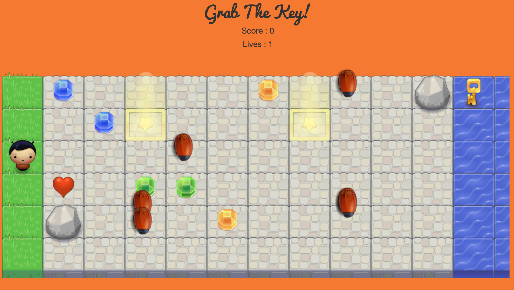

# Grab the Key!

<em>Grab the Key</em> is a very basic game built in HTML5 canvas. To play the game, download the zip folder on your laptop. Unzip the folder and click on the index.html file. If your default browser does not open the file, right click on the file and "open with" a browser of your choice. Enjoy the game.

# Instructions
Welcome to <em>Grab the Key</em>. Have you picked your character already? You are a genius. Now let us test your gaming skills as well. <em>Grab the Key</em> is a very simple game. All you need to do is cross the 10-feet road and guess what? Grab the Key! Grab some gems along the way and try to maximize your score. But wait, there are some bugs running all over the town looking for the delicious you. Also, there are some rocks which can hinder your movement. But since you are such a good looking character, you can grab a heart along the way so that if a bug eats you, you get one more chance to grab the key. Also, there are teleportation portals on the road which can teleport you to the other portal. They can be both good and bad. Play wisely. :) Remember, grab the key and maximize your score to complete the game.

# Controls

Control the player with the arrow keys on the keyboard. Needless to say, left arrow key takes the player one position to the left, right arrow key takes the player one position to the right, top arrow key takes the player one position to the top and similarly with the bottom arrow key. Please note, long pressing a key would not shift a character by multiple positions in the respective direction.

# Snapshot of the Game

